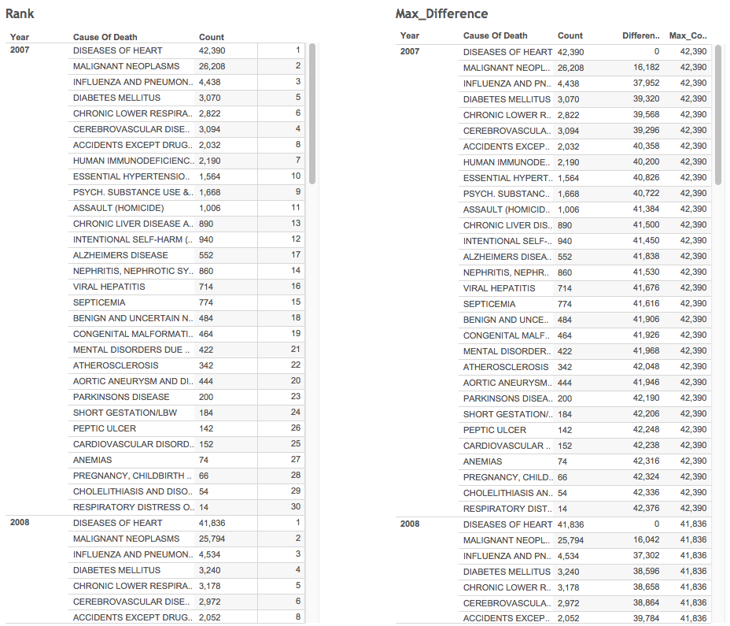
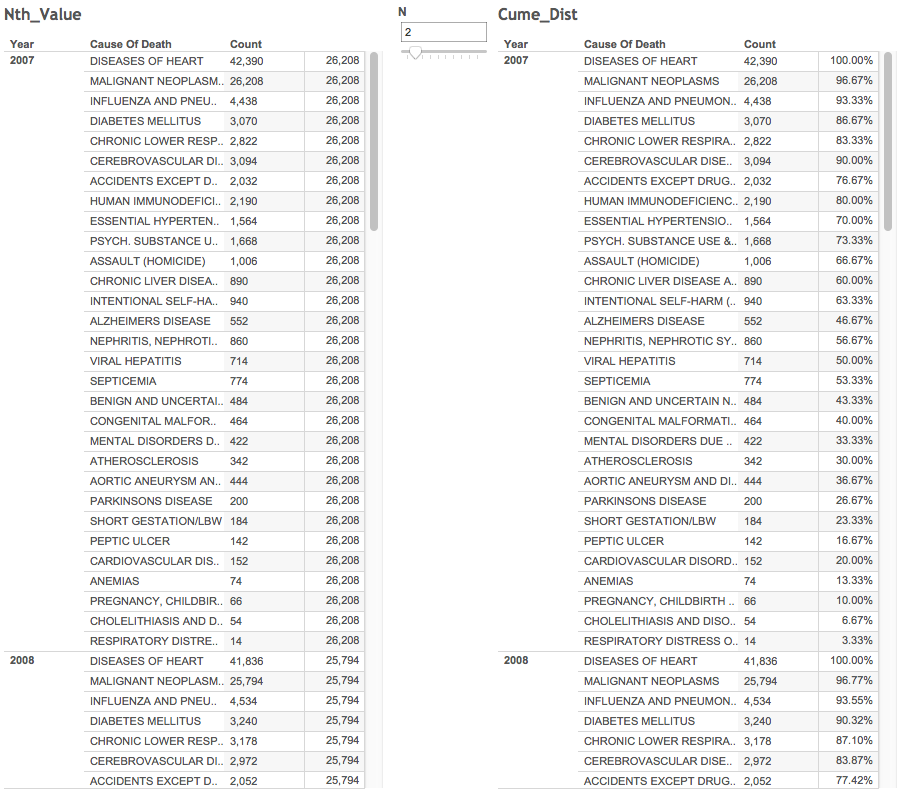

Tableau Project 2
====
**Group members: Fabiana Latorre, Oliver Benton Javier, Ernesto Canales, and Nikolaj Plagborg-Moller.**  

Our dataset can be found at 'http://catalog.data.gov/dataset/new-york-city-leading-causes-of-death-ce97f'.

We load the data-table into a variable named 'df' and display a subset of the data. To show data tables, we often use the 'head' function instead of tbl_df, since tbl_df sometimes does not display the important columns of a table.
  
```{r}
source('../01 SQL Crosstabs/Fetching_data.R', echo=TRUE)
```

**rank()**

We use a sub-query to sum the death counts in groups of year and death cause. The causes of death are then ranked according to their count for each year. The resulting table is displayed below along with a crosstab that lists the top five most frequent death causes for each year. We limited it to the top five, so that the resulting crosstab fits in this document.

```{r}
source('../01 SQL Crosstabs/Rank.R', echo=TRUE)
```

At this point, we asked on Piazza whether it was necessary to include a crosstab using the spread function for each table, and professor Cannata replied that it was not a requirement for the assignment. So the rest of our tables are not accompagnied by a spread-crosstab.

**last_value/max_value and difference**

We use two levels of sub-queries: One to sum the death counts in groups of year and death cause, and one to define the top death cause for each year. The difference between the count of the top death cause and the count for each row is also displayed.

```{r}
source('../01 SQL Crosstabs/Max_Diff.R', echo=TRUE)
```

**nth_value**

Again, we use a sub-query to sum the death counts in groups of year and death cause. We use the nth-value function to fetch and display the second highest death count for each year.

```{r}
source('../01 SQL Crosstabs/Nth_Value.R', echo=TRUE)
```

**cume_dist**

Once again, we use a sub-query to sum the death counts in groups of year and death cause. We use the cume_dist function to display the cumulative distribution of the death causes for each year.

```{r}
source('../01 SQL Crosstabs/Cume_Dist.R', echo=TRUE)
```

Below we have included screenshots of our four Tableau tables. The data in the tables are correct, but the sorting is slightly off for some rows. We have tried extensively to solve the problem, and we honestly think it might be a bug in Tableau. It is difficult to explain what we have attempted, so we would like to discuss the issue with you in person.





- The End